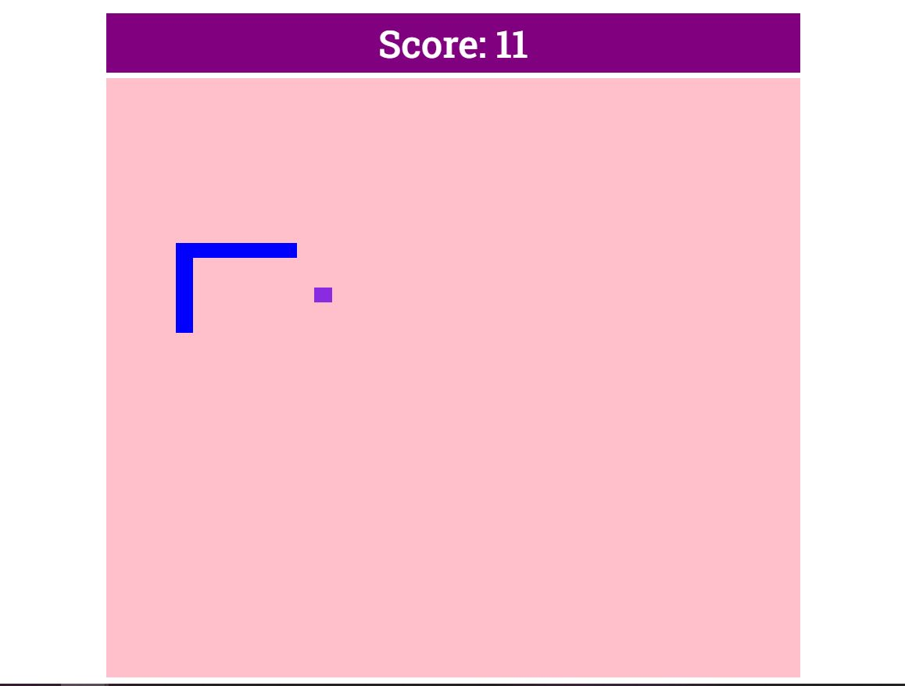
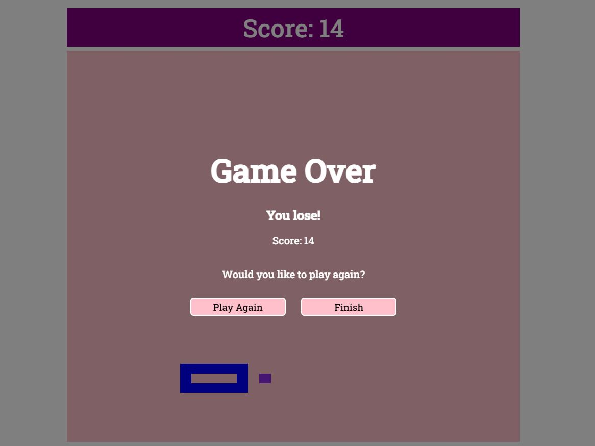

# Snake Game

## Description

This Snake game was created after following a YouTube tutoral by Web Dev Simplified  - https://www.youtube.com/watch?v=QTcIXok9wNY

It taught me the following things:

* How to use multiple JS files and import/export statements
* How to create a game loop
* How to create moving objects and update them based on certain criteria
* How to position elements in a CSS grid

I have customised this game by:
* Adding a a running score
* Creating a Game Over screen

At some point I want to develop this game further to include: 
* Customisable settings for speed and snake growth
* A top scores leaderboard 
* Replace the food squares with randomised food icons.

## Game Play:

 

## Installation

Please use the following link to access the website: https://e-davies.github.io/snake/

## Usage

This application will be used by people wanting to play the game Snake. 

## Skills

